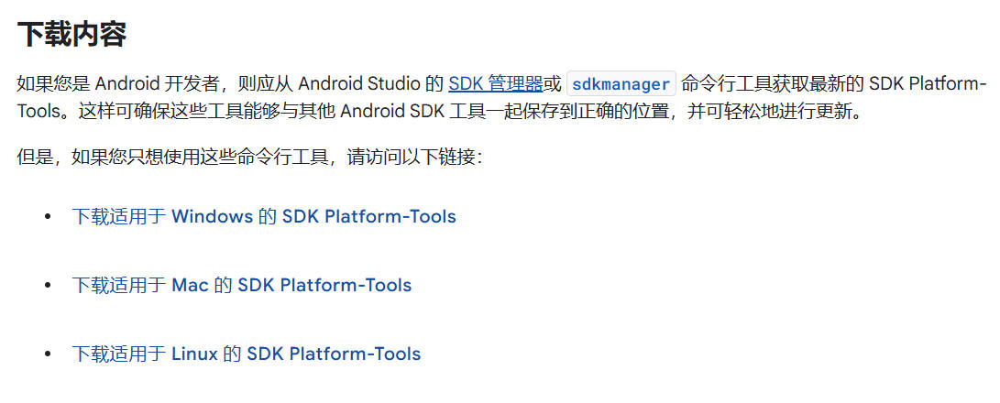
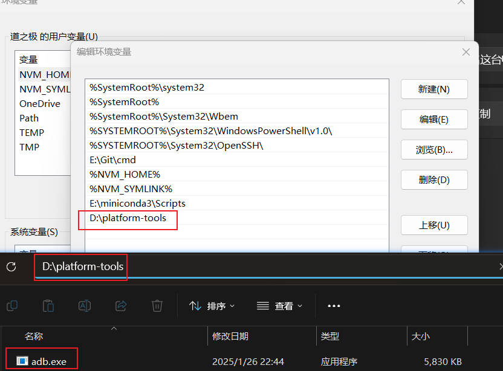
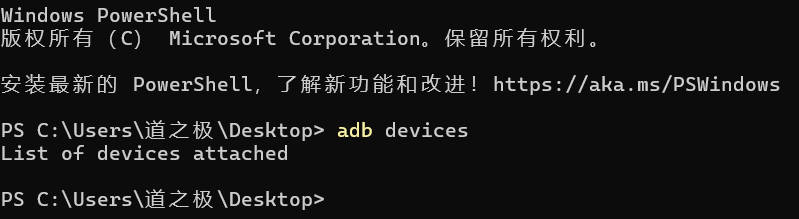

# 安装

## 1、官网下载
<https://developer.android.google.cn/tools/releases/platform-tools?hl=zh-cn>  
Windows版本：<https://dl.google.com/android/repository/platform-tools-latest-windows.zip>

## 2、下载Platform-Tools

## 3、配置环境变量
将platform-tools的路径添加到环境变量中

## 4、验证安装
打开命令行，输入`adb devices`，如果出现以下内容，则表示安装成功

