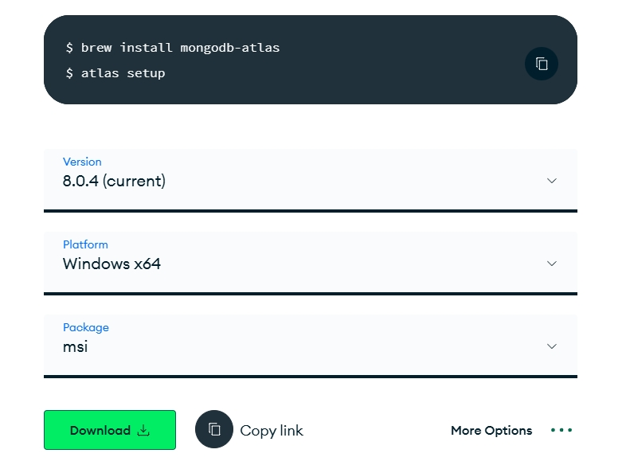
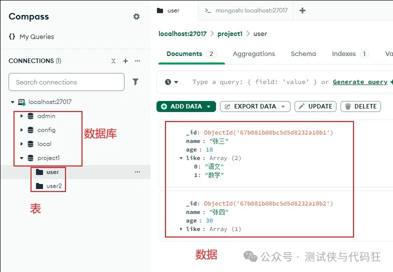

# 快速入门

## 一、官网

<https://www.mongodb.com/try/download/community>

### 1.Windows 安装

`如果没有特殊需求，建议使用 msi 格式安装，好处是简单，自带可视化`  


## 二、基本概念

### 1.概述

MongoDB 是一个基于分布式文件存储的数据库。由 C++语言编写。旨在为 WEB 应用提供可扩展的高性能数据存储解决方案。

MongoDB 是一个介于关系数据库和非关系数据库之间的产品，是非关系数据库当中功能最丰富，最像关系数据库的。

它支持的数据结构非常松散，是类似 json 的 bson 格式，因此可以存储比较复杂的数据类型。Mongo 最大的特点是它支持的查询语言非常强大，其语法有点类似于面向对象的查询语言，几乎可以实现类似关系数据库单表查询的绝大部分功能，而且还支持对数据建立索引。

### 2.特性

- **数据库（Database）**: 是集合的容器，相当于关系型 DB(SQL)中的数据库
- **集合（Collection）**: 数据库中的⼀组⽂档，相当于 SQL 中的表
- **文档（Document）**: 集合中的一条记录，相当于 SQL 的表中的一行。不同的文档之间不必有相同的结构，这一点是和 SQL 不同的。
- **字段（Field）**:文档中的键值对，相当于 SQL 中的列。比较重要的区别是 MongoDB 中的一个 field 可以是一个 JSON 对象或者数组。
  

安装好后默认会有三张表：

- **admin**: 从权限的角度来看，这是 root 数据库。如果将一个用户添加到这个数据库，这个用户会自动继承所有数据库的权限。一些特定的服务器端命令也只能从这个数据库运行，比如列出所有的数据库或者关闭服务器
- **local**: 这个数据永远不会被复制，可以用来存储限于本地单台服务器的任意集合
- **config**: 当 Mongo 用于分片设置时，config 数据库在内部使用，用于保存分片的相关信息

## 三、数据库操作命令

### 1.显示所有数据库

```shell
show databases
```

或者

```shell
show dbs
```

### 2.使用数据库

```shell
use <dbName>
```

### 3.创建数据库

MongoDB 是 NoSQL 数据库，它不需要显式地创建数据库而是通过插入数据来隐式创建数据库

例如：新增一张 project1 数据），再创建一张 user 表（集合），向表中插入一条数据（文档）

先使用`use project1`，再插入数据

```shell
db.user.insertOne(
    {"name":"张三","age":"男"}
)
```

### 4.删除数据库

test1 是数据库名称

```shell
db.test1.drop()
```

此命令前提需要使用数据库

```shell
db.dropDatabase()
```

## 四、对表进行操作

### 1.显示所有表

```shell
show collections
```

### 2.删除表

如果数据库中只有一张表，删除表后，数据库也会被删除

```shell
db.user.drop()
```

## 五、对数据进行操作

### 1.插入一条数据

```shell
db.user.insertOne({"name":"张三","age":"男"})
```

### 2.批量插入数据

```shell
db.user.insertMany([
    {"name":"张三","age":"男"},
    {"name":"张四","age":"女"}
])
```

### 3.更新一条数据

只更新已存在的字段

```shell
db.user.updateOne(
    { _id: ObjectId('67b071788bc5d5d8232a10ae') },  // 匹配条件
    { $set: { name: '张8' } }                     // 更新操作
)
```

新增一个 age 字段

```shell
db.user.updateOne(
    { _id: ObjectId('67b071788bc5d5d8232a10ae') },  // 匹配条件
    { $set: { age: 18 } }                     // 更新操作
)
```

删除 age 字段

```shell
db.user.updateOne(
    { _id: ObjectId("67b071788bc5d5d8232a10ae") },  // 匹配条件：指定要更新的文档
    { $unset: { age: "" } }  // 使用 $unset 删除 email 字段
)
```

删除多个字段

```shell
db.user.updateOne(
    { _id: ObjectId("67b071788bc5d5d8232a10ae") },  // 匹配条件：指定要更新的文档
    { $unset: { msg: "", name: "" } }  // 使用 $unset 删除 email 字段
)
```

### 4.批量更新数据

更新所有数据

```shell
db.user.updateMany(
    {},  // 匹配条件：匹配所有文档
    { $set: { name: '张xx' } } // 更新操作
)
```

通过匹配条件更新对应数据

```shell
db.user.updateMany(
    {_id:
      { $in: [
        ObjectId("67b073388bc5d5d8232a10af"),
        ObjectId("67b073388bc5d5d8232a10b0")]
      }
    },  // 匹配条件：匹配所有文档
    { $set: { name: '张瓜瓜' } } // 更新操作
)
```

### 5.删除一条数据

如果匹配条件为空{}，deleteOne()会删除表中的第一条数据

```shell
db.user.deleteOne({ name: "张三" })
```

### 6.批量删除

如果匹配条件为空{}，deleteMany()会删除表中的所有数据

```shell
db.user.deleteMany(
    {_id:
      { $in: [
        ObjectId("67b073388bc5d5d8232a10af"),
        ObjectId("67b073388bc5d5d8232a10b0")]
      }
    }
)
```

## 六、查询语句

### 1.查询表所有数

```shell
db.user.find()
```

### 2.指定条件查询

```shell
db.user.find({ name: "张三" })
```

### 3.返回特定字段

使用 1 表示包含字段，0 表示排除字段

```shell
db.user.find({}, { name: 1, age: 1, _id: 0 })
```

### 4.多条件查询

查询名字是”张三“，且年龄大于 25 的数据

```shell
db.user.find({ name: "张三", age: { $gt: 25 } })
```

### 5.排序 sort

使用 1 表示升序，-1 表示降序

```shell
db.user.find().sort({ age: 1 })
```

### 6.限制 limit

使用 1 表示升序，-1 表示降序

```shell
db.user.find().limit(3)
```

## 七、常用操作字符

| 操作符 | 作用 | 使用场景 |
| --- | --- | --- |
| `$size` | 检查数组字段的长度是否等于指定值 | 查询数组长度为特定值的文档，例如查询包含特定数量元素的数组字段 |
| `$gt` | 大于指定值 | 查询字段值大于某个特定值的文档，例如查询价格大于某个数值的商品 |
| `$gte` | 大于等于指定值 | 查询字段值大于等于某个特定值的文档，例如查询年龄大于等于某个数值的用户 |
| `$lt` | 小于指定值 | 查询字段值小于某个特定值的文档，例如查询价格小于某个数值的商品 |
| `$lte` | 小于等于指定值 | 查询字段值小于等于某个特定值的文档，例如查询年龄小于等于某个数值的用户 |
| `$eq` | 等于指定值 | 查询字段值等于某个特定值的文档，例如查询名字为某个特定值的用户 |
| `$ne` | 不等于指定值 | 查询字段值不等于某个特定值的文档，例如查询价格不等于某个数值的商品 |
| `$in` | 字段值在指定数组中 | 查询字段值在某个数组中的文档，例如查询类别属于某个数组的商品 |
| `$nin` | 字段值不在指定数组中 | 查询字段值不在某个数组中的文档，例如查询类别不属于某个数组的商品 |
| `$exists` | 检查字段是否存在 | 查询文档中是否包含某个字段，例如查询包含某个特定字段的文档 |
| `$type` | 检查字段类型 | 查询字段类型为指定类型的文档，例如查询某个字段为字符串类型的文档 |
| `$all` | 检查数组字段是否包含指定的所有值 | 查询数组字段包含所有指定值的文档，例如查询数组字段包含多个特定值的文档 |
| `$elemMatch` | 检查数组字段中是否有满足条件的元素 | 查询数组字段中至少有一个元素满足条件的文档，例如查询数组字段中某个子字段满足条件的文档 |
| `$text` | 在指定字段中进行全文搜索 | 查询字段中包含特定文本的文档，例如查询某个字段中包含特定关键词的文档 |
