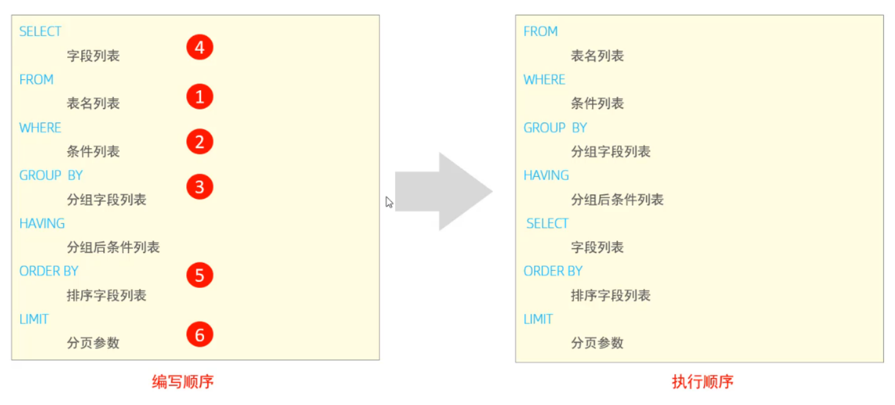

# DQL语句（数据查询语⾔，⽤来查询数据库中表的记录）
# 一、准备数据

```sql
create table emp
(
    id          int comment '编号',
    number      varchar(10) comment '工号',
    name        varchar(10) comment '姓名',
    gender      char(1) comment '性别',
    age         tinyint unsigned comment '年龄',
    idCard      char(18) comment '身份证号',
    workAddress varchar(50) comment '工作地址',
    joinDate    date comment '入职时间'
) comment '员工表';
```

```sql
INSERT INTO emp (id, number, name, gender, age, idCard, workAddress, joinDate)
VALUES (1, '00001', '柳岩666', '女', 20, '123456789012345678', '北京', '2000-01-01');
INSERT INTO emp (id, number, name, gender, age, idCard, workAddress, joinDate)
VALUES (2, '00002', '张无忌', '男', 18, '123456789012345670', '北京', '2005-09-01');
INSERT INTO emp (id, number, name, gender, age, idCard, workAddress, joinDate)
VALUES (3, '00003', '韦一笑', '男', 38, '123456789712345670', '上海', '2005-08-01');
INSERT INTO emp (id, number, name, gender, age, idCard, workAddress, joinDate)
VALUES (4, '00004', '赵敏', '女', 18, '123456757123845670', '北京', '2009-12-01');
INSERT INTO emp (id, number, name, gender, age, idCard, workAddress, joinDate)
VALUES (5, '00005', '小昭', '女', 16, '123456769012345678', '上海', '2007-07-01');
INSERT INTO emp (id, number, name, gender, age, idCard, workAddress, joinDate)
VALUES (6, '00006', '杨逍', '男', 28, '12345678931234567X', '北京', '2006-01-01');
INSERT INTO emp (id, number, name, gender, age, idCard, workAddress, joinDate)
VALUES (7, '00007', '范瑶', '男', 40, '123456789212345670', '北京', '2005-05-01');
INSERT INTO emp (id, number, name, gender, age, idCard, workAddress, joinDate)
VALUES (8, '00008', '黛绮丝', '女', 38, '123456157123645670', '天津', '2015-05-01');
INSERT INTO emp (id, number, name, gender, age, idCard, workAddress, joinDate)
VALUES (9, '00009', '范凉凉', '女', 45, '123156789012345678', '北京', '2010-04-01');
INSERT INTO emp (id, number, name, gender, age, idCard, workAddress, joinDate)
VALUES (10, '00010', '陈友谅', '男', 53, '123456789012345670', '上海', '2011-01-01');
INSERT INTO emp (id, number, name, gender, age, idCard, workAddress, joinDate)
VALUES (11, '00011', '张士诚', '男', 55, '123567897123465670', '江苏', '2015-05-01');
INSERT INTO emp (id, number, name, gender, age, idCard, workAddress, joinDate)
VALUES (12, '00012', '常遇春', '男', 32, '123446757152345670', '北京', '2004-02-01');
INSERT INTO emp (id, number, name, gender, age, idCard, workAddress, joinDate)
VALUES (13, '00013', '张三丰', '男', 88, '123656789012345678', '江苏', '2020-11-01');
INSERT INTO emp (id, number, name, gender, age, idCard, workAddress, joinDate)
VALUES (14, '00014', '灭绝', '女', 65, '123456719012345670', '西安', '2019-05-01');
INSERT INTO emp (id, number, name, gender, age, idCard, workAddress, joinDate)
VALUES (15, '00015', '胡青牛', '男', 70, '12345674971234567X', '西安', '2018-04-01');
INSERT INTO emp (id, number, name, gender, age, idCard, workAddress, joinDate)
VALUES (16, '00016', '周芷若', '女', 18, null, '北京', '2012-06-01');
```

# 二、单表查询

## 1.基本查询

**1.查询多个字段**

```sql
select 字段 from 表名;
select * from emp;
select name,gender from emp;
```

**2.字段设置别名**

```sql
SELECT 字段1 [ AS 别名1 ] , 字段2 [ AS 别名2 ] ... FROM 表名;
select name as username,gender as sex from emp;
```

**3.去除重复记录**

```sql
SELECT DISTINCT 字段列表 FROM 表名; 
select distinct workaddress from emp;
```
# 三、多条件查询

| 比较运算符 | 功能 |
| --- | --- |
| >  | 大于 |
| >= | 大于等于 |
| < | 小于 |
| <= | 小于等于 |
| =  | 等于 |
| <> 或 != | 不等于 |
| BETWEEN ... AND ...  | 在某个范围之内(含最小、最大值) |
| IN(...)  | 在in之后的列表中的值，多选一 |
| LIKE 占位符  | 模糊匹配(_匹配单个字符, %匹配任意个字符) |
| IS NULL  | 是NULL |

| 逻辑运算符  | 功能 |
| --- | --- |
| AND 或 && | 并且 (多个条件同时成立) |
| OR 或 ||  | 或者 (多个条件任意一个成立) |
| NOT 或 !  | 非 , 不是 |

```sql
查询出id为1的name、idcard数据
查询年龄小于 20 的员工信息
查询年龄小于等于 20 的员工信息
查询没有身份证号的员工信息
查询有身份证号的员工信息
查询年龄不等于 88 的员工信息
查询年龄在15岁(包含) 到 20岁(包含)之间的员工信息
查询性别为 女 且年龄小于 25岁的员工信息
查询年龄等于18 或 20 或 40 的员工信息
查询姓名为两个字的员工信息。模糊匹配(_匹配单个字符, %匹配任意个字符)
查询身份证号最后一位是X的员工信息
```

```sql
SELECT 字段列表 FROM 表名 WHERE 条件列表 ;
// 查询出id为1的name、idcard数据
select name,idcard from emp where id = 1;
// 查询年龄小于 20 的员工信息
select * from emp where age < 20;
// 查询年龄小于等于 20 的员工信息
select * from emp where age <= 20;
// 查询没有身份证号的员工信息
select * from emp where idcard is null;
// 查询有身份证号的员工信息
select * from emp where idcard is not null;
// 查询年龄不等于 88 的员工信息
select * from emp where age != 88;
select * from emp where age <> 88;
// 查询年龄在15岁(包含) 到 20岁(包含)之间的员工信息
select * from emp where age >= 15 && age <= 20;
select * from emp where age >= 15 and age <= 20;
select * from emp where age between 15 and 20;
// 查询性别为 女 且年龄小于 25岁的员工信息
select * from emp where gender = '女' and age < 25;
//  查询年龄等于18 或 20 或 40 的员工信息
select * from emp where age = 18 or age = 20 or age =40;
select * from emp where age in(18,20,40);
//  查询姓名为两个字的员工信息。模糊匹配(_匹配单个字符, %匹配任意个字符)
select * from emp where name like '__';
//  查询身份证号最后一位是X的员工信息
select * from emp where idcard like '%X';
select * from emp where idcard like '_________________X';
```
# 四、聚合函数

| 函数  | 功能 |
| --- | --- |
| count | 统计数量 |
| max | 最大值 |
| min | 最小值 |
| avg | 平均值 |
| sum | 求和 |

```sql
统计该企业员工数量

统计该企业员工的平均年龄

统计该企业员工的最大年龄

统计该企业员工的最小年龄

统计西安地区员工的年龄之和
```

**注意** : NULL值是不参与所有聚合函数运算的。

```sql
SELECT 聚合函数(字段列表) FROM 表名 ;
// 统计该企业员工数量
select count(*) from emp; -- 统计的是总记录数
select count(idcard) from emp; -- 统计的是idcard字段不为null的记录数
// 统计该企业员工的平均年龄
select avg(age) from emp;
// 统计该企业员工的最大年龄
select max(age) from emp;
// 统计该企业员工的最小年龄
select min(age) from emp;
// 统计西安地区员工的年龄之和
select sum(age) from emp where workaddress = '西安';
```
# 五、分组查询

## **where与having区别：**

- **执行时机不同**：where是分组之前进行过滤，不满足where条件，不参与分组；而having是分组之后对结果进行过滤。
- **判断条件不同**：where不能对聚合函数进行判断，而having可以。

**注意事项:**

- 分组之后，查询的字段一般为聚合函数和分组字段，查询其他字段无任何意义。
- 执行顺序: where > 聚合函数 > having。
- 支持多字段分组, 具体语法为 : group by columnA,columnB

```sql
根据性别分组 , 统计男性员工 和 女性员工的数量

根据性别分组 , 统计男性员工 和 女性员工的平均年龄

查询年龄小于45的员工 , 并根据工作地址分组 , 获取员工数量大于等于3的工作地址

统计各个工作地址上班的男性及女性员工的数量
```

```sql
SELECT 字段列表 FROM 表名 [ WHERE 条件 ] GROUP BY 分组字段名 [ HAVING 分组后过滤条件 ];

// 根据性别分组 , 统计男性员工 和 女性员工的数量
select gender, count(*) from emp group by gender ;

// 根据性别分组 , 统计男性员工 和 女性员工的平均年龄
select gender, avg(age) from emp group by gender ;

// 查询年龄小于45的员工 , 并根据工作地址分组 , 获取员工数量大于等于3的工作地址
select workaddress, count(*) address_count from emp where age < 45 group by workaddress having address_count >= 3;

// 统计各个工作地址上班的男性及女性员工的数量
select workaddress, gender, count(*) '数量' from emp group by gender , workaddress;
```
# 六、排序查询

- ASC : 升序(默认值)
- DESC: 降序
- 如果是多字段排序，当第一个字段值相同时，才会根据第二个字段进行排序

```sql
根据年龄对公司的员工进行升序排序

根据入职时间, 对员工进行降序排序

根据年龄对公司的员工进行升序排序 , 年龄相同 , 再按照入职时间进行降序排序
```

```sql
SELECT 字段列表 FROM 表名 ORDER BY 字段1 排序方式1 , 字段2 排序方式2 ; 
// 根据年龄对公司的员工进行升序排序
select * from emp order by age asc; 
select * from emp order by age; 
// 根据入职时间, 对员工进行降序排序
select * from emp order by entrydate desc; 
// 根据年龄对公司的员工进行升序排序 , 年龄相同 , 再按照入职时间进行降序排序
select * from emp order by age asc , entrydate desc;
```
# 七、分页查询

- 起始索引从0开始，起始索引 = （查询页码 - 1）* 每页显示记录数。
- 分页查询是数据库的方言，不同的数据库有不同的实现，MySQL中是LIMIT。
- 如果查询的是第一页数据，起始索引可以省略，直接简写为 limit 10。

```sql
SELECT 字段列表 FROM 表名 LIMIT 起始索引, 查询记录数 ; 
//  查询第1页员工数据, 每页展示10条记录
select * from emp limit 0,10; 
select * from emp limit 10; 
// 查询第2页员工数据, 每页展示10条记录 --------> (页码-1)*页展示记录数
select * from emp limit 10,10
```

# 八、综合案例

```sql
查询年龄为20,21,22,23岁的员工信息。

查询性别为 男 ，并且年龄在 20-40 岁(含)以内的姓名为三个字的员工

统计员工表中, 年龄小于60岁的 , 男性员工和女性员工的人数。

查询所有年龄小于等于35岁员工的姓名和年龄，并对查询结果按年龄升序排序，如果年龄相同按入职时间降序排序。

查询性别为男，且年龄在20-40 岁(含)以内的前5个员工信息，对查询的结果按年龄升序排序，年龄相同按入职时间升序排序。
```

```sql
// 查询年龄为20,21,22,23岁的员工信息。
select * from emp where age in(20,21,22,23)

// 查询性别为 男 ，并且年龄在 20-40 岁(含)以内的姓名为三个字的员工
select * from emp where gender = '男' and (age between 20 and 40) and name like '___'

// 统计员工表中, 年龄小于60岁的 , 男性员工和女性员工的人数。
select gender,count(*) from emp where age < 60 group by gender

// 查询所有年龄小于等于35岁员工的姓名和年龄，并对查询结果按年龄升序排序，如果年龄相同按入职时间降序排序。
select * from emp where age <= 35 order by age, joinDate desc

// 查询性别为男，且年龄在20-40 岁(含)以内的前5个员工信息，对查询的结果按年龄升序排序，年龄相同按入职时间升序排序。
select * from emp where gender = '男' and (age between 20 and 40) order by age,joinDate desc limit 5
```

# 九、执行顺序


