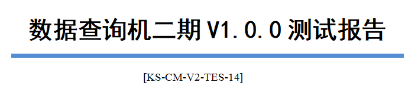
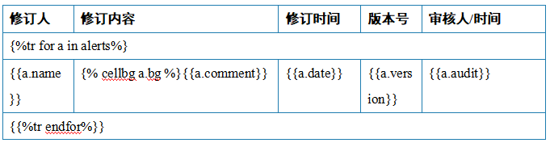
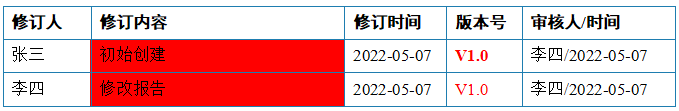
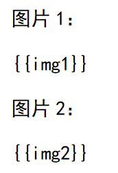
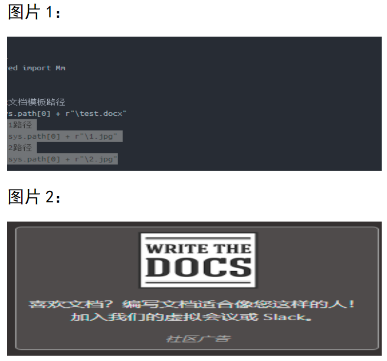
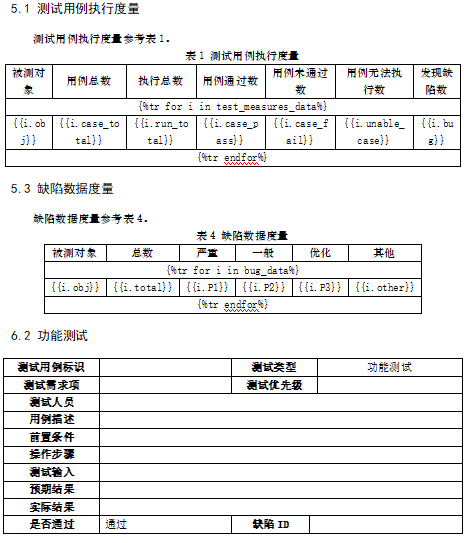
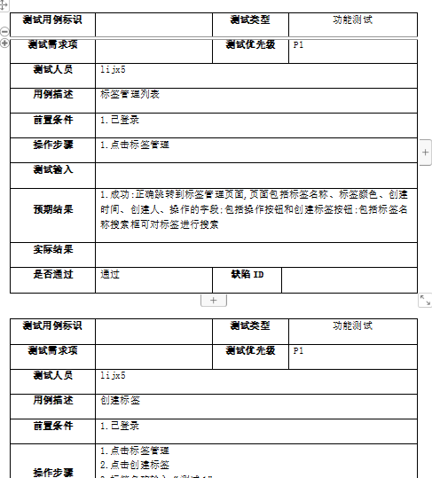
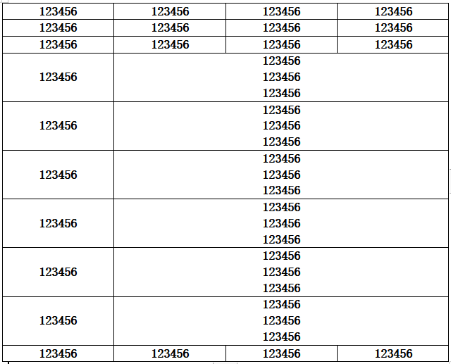
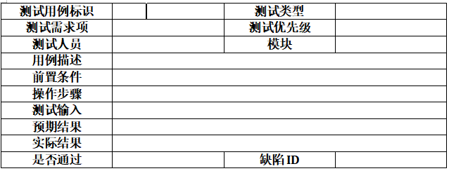

# 操作word

## 一、python-docx

官网：[https://www.osgeo.cn/python-docx/](https://www.osgeo.cn/python-docx/)

作用：生成word文档

```bash
pip install python-docx
```

## 二、docxtpl的使用

官网：[https://docxtpl.readthedocs.io/en/latest/#](https://docxtpl.readthedocs.io/en/latest/#)

git：[https://github.com/elapouya/python-docx-template/tree/master/tests](https://github.com/elapouya/python-docx-template/tree/master/tests)

作用：根据word模板生成一份新的word，git test下有很多例子

```bash
pip install docxtpl
```

### 1.替换文字


```python
from docxtpl import DocxTemplate

# 模板文档
doc = DocxTemplate("D:\Desktop\测试报告.docx")
# 待替换对象
context = {
    "报告名称": "数据查询机二期V1.0.0测试报告",
}
# 执行替换
doc.render(context)
# 保存新的文档
doc.save("test.docx")
```



### 2.操作表格

- 语法与django类似
-  更改单元格背景色



```python
from datetime import datetime

from docxtpl import DocxTemplate, RichText

# 模板文档
doc = DocxTemplate("D:\Desktop\测试报告.docx")
# 待替换对象
# TODO RichText：可以设置一些样式：color（字体颜色）、bold（是否加粗）
context = {
    'alerts': [
        {'name': '张三',
         'comment': '初始创建',
         'date': datetime.now().strftime('%Y-%m-%d'),
         'version': RichText('V1.0', color='FF0000', bold=True),
         'audit': '李四/{}'.format(datetime.now().strftime('%Y-%m-%d')),
         'bg': 'FF0000'
         },
        {'name': '李四',
         'comment': '修改报告',
         'date': datetime.now().strftime('%Y-%m-%d'),
         'version': RichText('V1.0', color='FF0000'),
         'audit': '李四/{}'.format(datetime.now().strftime('%Y-%m-%d')),
         'bg': 'FF0000'
         },
    ],
}
# 执行替换
doc.render(context)
# 保存新的文档
doc.save("test.docx")
```



### 3.插入图片



```python
from datetime import datetime
from docx.shared import Mm
from docxtpl import DocxTemplate, RichText, InlineImage

# 模板文档
doc = DocxTemplate("D:\Desktop\测试报告.docx")
# 要插入的图片1路径
image1_path = "img.png"
# 要插入的图片2路径
image2_path = "img_1.png"
# 创建2张图片对象
insert_image1 = InlineImage(doc, image1_path, width=Mm(140), height=Mm(50))
insert_image2 = InlineImage(doc, image2_path, width=Mm(140), height=Mm(50))
# 待替换对象
context = {
    "img1": insert_image1,
    "img2": insert_image2,
}
# 执行替换
doc.render(context)
# 保存新的文档
doc.save("test.docx")
```



### 4.完整代码

```python
from datetime import datetime
from docx.shared import Mm
from docxtpl import DocxTemplate, RichText, InlineImage

# 模板文档
doc = DocxTemplate("D:\Desktop\测试报告.docx")
# 要插入的图片1路径
image1_path = "img.png"
# 要插入的图片2路径
image2_path = "img_1.png"
# 创建2张图片对象
insert_image1 = InlineImage(doc, image1_path, width=Mm(140), height=Mm(50))
insert_image2 = InlineImage(doc, image2_path, width=Mm(140), height=Mm(50))
# 待替换对象
# TODO RichText：可以设置一些样式：color（字体颜色）、bold（是否加粗）
context = {
    "报告名称": "数据查询机二期V1.0.0测试报告",
    "报告时间": datetime.now().strftime('%Y-%m-%d'),
    "img1": insert_image1,
    "img2": insert_image2,
    'alerts': [
        {'name': '张三',
         'comment': '初始创建',
         'date': datetime.now().strftime('%Y-%m-%d'),
         'version': RichText('V1.0', color='FF0000', bold=True),
         'audit': '李四/{}'.format(datetime.now().strftime('%Y-%m-%d')),
         'bg': 'FF0000'
         },
        {'name': '李四',
         'comment': '修改报告',
         'date': datetime.now().strftime('%Y-%m-%d'),
         'version': RichText('V1.0', color='FF0000'),
         'audit': '李四/{}'.format(datetime.now().strftime('%Y-%m-%d')),
         'bg': 'FF0000'
         },
    ],
}
# 执行替换
doc.render(context)
# 保存新的文档
doc.save("test.docx")
```

## 三.python-docx的使用

这个工具一般用法可以看官方文档，我这里主要说一下，根据已有的模板生成新的word文档

### 1.模板文件



### 2.需求：根据第三个表批量生成数据

```python
from docx import Document
from docx.oxml.ns import qn
from docx.shared import Pt
from copy import deepcopy

class OperationDocx:

    def __init__(self, template_file):
        self.template_file = template_file
        self.document = Document(self.template_file)
        # 获取模块里第三个表格
        self.table = self.document.tables[2]

    def generate_word(self, word_path):
        # TODO 用例等级、负责人、用例描述、前置条件、用例步骤、''、预期结果
        case_nums = [
            ['P1', 'lijx5', '标签管理列表', '1.已登录', '1.点击标签管理', '',
             '1.成功:正确跳转到标签管理页面,页面包括标签名称、标签颜色、创建时间、创建人、操作的字段;包括操作按钮和创建标签按钮;包括标签名称搜索框可对标签进行搜索'],
            ['P1', 'lijx5', '创建标签', '1.已登录', '1.点击标签管理\n2.点击创建标签\n3.标签名称输入“测试1”\n4.标签颜色选择黑色，点击确定', '',
             '1.\n2.\n3.\n4.成功:标签管理页面正确显示名为“测试1”的标签,标签颜色为黑色'], ['P1', 'lijx5', '创建标签名称字符串超长', '1.已登录',
                                                                '1.点击标签管理\n2.点击创建标签\n3.标签名称输入“12345678901”\n4.标签颜色选择黑色，点击确定',
                                                                '', '1.\n2.\n3.\n4.成功:页面提示由于标签名称过长,无法创建该标签']
        ]
        docx = Document()
        # 设置字体与大小
        docx.styles['Normal'].font.name = u'宋体'
        docx.styles['Normal'].font.size = Pt(10.5)
        docx.styles['Normal']._element.rPr.rFonts.set(qn('w:eastAsia'), u'宋体')
        for case in case_nums:
            new_table = deepcopy(self.table)
            for i in range(1, 8):
                new_table.cell(i, 4).text = case[i - 1].replace('#', '').replace('*', "")
            paragraph = docx.add_paragraph()
            paragraph._p.addnext(new_table._element)
        docx.save(word_path)

if __name__ == '__main__':
    test = OperationDocx(r'D:\Desktop\报告模板.docx')
    test.generate_word(r'table123.docx')
```

### 3.结果



### 4.绘制表格

设置单元格属性

```python
from docx import Document
from docx.enum.table import WD_TABLE_ALIGNMENT, WD_ALIGN_VERTICAL # WD_ALIGN_VERTICAL 会报错，不管
from docx.shared import Cm, RGBColor, Pt

path = 'table123.docx'

doc = Document()

table1 = doc.add_table(rows=10, cols=4, style='Table Grid')

for row in range(10):
    for col in range(4):
        # TODO 向单元格写入数据有以下两种方式
        # table1.cell(row, col).text = str(list1[row][col])
        run = table1.cell(row, col).paragraphs[0].add_run('123456')
        # TODO 单元格文本颜色，http://tools.jb51.net/static/colorpicker/index.html
        run.font.color.rgb = RGBColor(0, 0, 0)
        # TODO 单元格字体
        run.font.name = '宋体'
        # TODO 单元格字体大小
        run.font.size = Pt(12)
        # TODO 单元格文本加粗
        run.bold = True
        # 向单元格插入图片
        # table1.cell(col, 4).paragraphs[0].add_run().add_picture('1.jpg', width=Cm(10))
        # TODO 单元格数据水平对其方式
        table1.cell(row, col).paragraphs[0].paragraph_format.alignment = WD_TABLE_ALIGNMENT.CENTER
        # TODO 单元格数据垂直对其方式   TOP:文本与单元格的上边框对齐。CENTER:文本与单元格的中心对齐。BOTTOM:文本与单元格的下边框对齐
        table1.cell(row, col).vertical_alignment = WD_ALIGN_VERTICAL.CENTER
# TODO 合并单元格
for i in range(3, 9):
    cell_1 = table1.cell(i, 1)
    cell_2 = table1.cell(i, 3)
    cell_1.merge(cell_2)
# TODO 对于合并的单元格设置宽度
  table1.autofit = False
  table1.allow_autofit = False
  table1.columns[0].width = Inches(1.3)
  # table1.rows[0].cells[0].width = Inches(1.5)
doc.save(path)
```



设置表格属性

```python
from docx import Document
from docx.enum.table import WD_TABLE_ALIGNMENT, WD_ALIGN_VERTICAL  # WD_ALIGN_VERTICAL 会报错，不管
from docx.shared import Cm, RGBColor, Pt
from docx.oxml.ns import qn

path = 'table123.docx'

doc = Document()
# TODO 创建表格
table1 = doc.add_table(rows=10, cols=4, style='Table Grid')
# TODO 设置表格字体属性
table1.style.font.size = Pt(12)  # 字体大小
table1.style.font.color.rgb = RGBColor(0, 0, 0)  # 字体颜色
table1.style.paragraph_format.alignment = WD_TABLE_ALIGNMENT.CENTER  # 水平居中
col1 = ['测试用例标识', '测试需求项', '测试人员', '用例描述', '前置条件', '操作步骤', '测试输入', '预期结果', '实际结果', '是否通过']
col3 = ['测试类型', '测试优先级', '模块', '缺陷ID']
# TODO 向第一列和第三列插入数据
for col_data in col1:
    col_index = col1.index(col_data)
    run = table1.cell(col_index, 0).paragraphs[0].add_run(col_data)

# TODO 合并单元格
for i in range(3, 9):
    cell_1 = table1.cell(i, 1)
    cell_2 = table1.cell(i, 3)
    cell_1.merge(cell_2)
doc.save(path)
```

示例

```python
from docx import Document
from docx.enum.table import WD_TABLE_ALIGNMENT, WD_ALIGN_VERTICAL  # WD_ALIGN_VERTICAL 会报错，不管
from docx.shared import Cm, RGBColor, Pt
from docx.oxml.ns import qn

path = 'table123.docx'

doc = Document()
# TODO 创建表格
table1 = doc.add_table(rows=10, cols=4, style='Table Grid')
# TODO 设置表格字体属性
table1.style.font.size = Pt(12)  # 字体大小
table1.style.font.color.rgb = RGBColor(0, 0, 0)  # 字体颜色
col1 = ['测试用例标识', '测试需求项', '测试人员', '用例描述', '前置条件', '操作步骤', '测试输入', '预期结果', '实际结果', '是否通过']
col3 = ['测试类型', '测试优先级', '模块', '', '', '', '', '', '', '缺陷ID']
# TODO 向第一列插入数据
for row_index in [0, 2]:
    for col_data in col1:
        col_index = col1.index(col_data)
        if row_index == 2:
            run = table1.cell(col_index, row_index).paragraphs[0].add_run(col3[col_index])
        else:
            run = table1.cell(col_index, row_index).paragraphs[0].add_run(col_data)
        # TODO 单元格文本加粗
        run.bold = True
        # TODO 单元格数据水平对其方式
        table1.cell(col_index, row_index).paragraphs[0].paragraph_format.alignment = WD_TABLE_ALIGNMENT.CENTER

# TODO 合并单元格
for i in range(3, 9):
    cell_1 = table1.cell(i, 1)
    cell_2 = table1.cell(i, 3)
    cell_1.merge(cell_2)
doc.save(path)
```



```python
from copy import deepcopy
from docx import Document
from docx.oxml.ns import qn
from docx.enum.table import WD_TABLE_ALIGNMENT, WD_ALIGN_VERTICAL  # WD_ALIGN_VERTICAL 会报错，不管
from docx.shared import Pt, Inches
import pandas as pd
from tqdm import tqdm

class GenerateProgramRecordCase:
    """生成测试方案和测试记录word用例"""

    def __init__(self):
        self.doc = Document()
        # TODO 设置字体与大小
        self.doc.styles['Normal'].font.name = u'宋体'
        self.doc.styles['Normal'].font.size = Pt(12.5)
        self.doc.styles['Normal']._element.rPr.rFonts.set(qn('w:eastAsia'), u'宋体')

    @staticmethod
    def read_excel(excel_path, excel_sheet):
        """
        读取excel用例
        :param excel_path: E:\项目\福州\测试用例\运行监测系统-测试用例.xlsx
        :param excel_sheet:sheet名称  预警预测
        :return:
        """
        excel_data = pd.read_excel(excel_path, excel_sheet)
        data = excel_data.values
        result = []
        case_id = 1
        for i in data[1:]:
            if str(i[3]) != 'nan' and str(i[5]) != 'nan' and str(i[7]) != 'nan' and str(i[8]) != 'nan':
                temporary_data = ["13-"+str(case_id+136), i[3], i[5], i[7], i[8], "□ 通  过      □ 不通过        □ 未测试", ""]
                result.append(temporary_data)
                case_id += 1
        return result

    def generate_word(self, data):
        """
        将excel一条用例转化为word表格
        :param data: ['1-1-1-1', '预警预测-运行监测指标体系', '检查目录新增功能', '1.右击根目录，点击新增子目录\n2.右击新增的目录，点击新增同级目录']
        :return:
        """
        table = self.doc.add_table(rows=7, cols=2, style='Table Grid')
        title = ['测试编号', '测试项目', '功能说明', '测试过程（步骤）', '现象描述', '实测结果', '备注']
        for col in range(2):
            for row in range(7):
                # TODO 向单元格写入数据有以下两种方式
                if col == 0:
                    table.cell(row, col).paragraphs[0].add_run(title[row])
                    # TODO 单元格数据水平对其方式
                    table.cell(row, col).paragraphs[0].paragraph_format.alignment = WD_TABLE_ALIGNMENT.CENTER
                else:
                    table.cell(row, col).paragraphs[0].add_run(data[row])
                    # TODO 单元格数据水平对其方式
                    table.cell(row, col).paragraphs[0].paragraph_format.alignment = WD_TABLE_ALIGNMENT.LEFT
                # TODO 单元格数据垂直对其方式   TOP:文本与单元格的上边框对齐。CENTER:文本与单元格的中心对齐。BOTTOM:文本与单元格的下边框对齐
                table.cell(row, col).vertical_alignment = WD_ALIGN_VERTICAL.CENTER
        # TODO 对于合并的单元格设置宽度
        table.autofit = False
        table.allow_autofit = False
        table.columns[0].width = Inches(2.0)
        table.columns[1].width = Inches(4.0)
        # TODO 输入一个空格
        self.doc.add_paragraph()

    def run(self, excel_path, excel_sheet):
        """
        :param excel_path: E:\项目\福州\测试用例\运行监测系统-测试用例.xlsx
        :param excel_sheet:sheet名称  预警预测
        :return:
        """
        # TODO 生成测试记录用例
        for i in tqdm(self.read_excel(excel_path, excel_sheet)):
            self.generate_word(i)
        self.doc.save('测试记录用例.docx')
        # TODO 生成测试方案用例
        docx = Document()
        docx.styles['Normal'].font.name = u'宋体'
        docx.styles['Normal'].font.size = Pt(12)
        docx.styles['Normal']._element.rPr.rFonts.set(qn('w:eastAsia'), u'宋体')
        document = Document('测试记录用例.docx')
        for table in tqdm(document.tables):
            new_table = deepcopy(table)
            for i in range(3):
                row = new_table.rows[-1]
                row._element.getparent().remove(row._element)
                paragraph = docx.add_paragraph()
                paragraph._p.addnext(new_table._element)
        docx.save('测试方案用例.docx')

if __name__ == '__main__':
    test_program = GenerateProgramRecordCase()
    test_program.run(r"E:\项目\福州\测试用例\应急系统-测试用例.xlsx", '应急演练')
```

### 5.根据前端代码识别word表格

```python
from bs4 import BeautifulSoup
from docx import Document
from docx.enum.table import WD_TABLE_ALIGNMENT
from docx.shared import RGBColor, Pt

# 你的HTML表格字符串
html_table = """
<p><br></p><table style="width: 100%;table-layout: fixed;"><tbody><tr><td colSpan="1" rowSpan="1" width="auto" style="">第一列</td><td colSpan="1" rowSpan="1" width="auto" style=""><strong>第二列</strong></td><td colSpan="1" rowSpan="1" width="auto" style="">第三列</td><td colSpan="1" rowSpan="1" width="auto" style="">第四列</td></tr><tr><td colSpan="2" rowSpan="1" width="auto" style="">1</td><td colSpan="1" rowSpan="1" width="auto" style="display:none"></td><td colspan="1" rowspan="1" width="auto" style="text-align: center;">2</td><td colSpan="1" rowSpan="1" width="auto" style="">3</td></tr><tr><td colSpan="1" rowSpan="1" width="auto" style="">4</td><td colSpan="1" rowSpan="1" width="auto" style="">5</td><td colSpan="1" rowSpan="3" width="auto" style="">6</td><td colSpan="1" rowSpan="1" width="auto" style="">7</td></tr><tr><td colSpan="1" rowSpan="1" width="auto" style="">8</td><td colSpan="1" rowSpan="1" width="auto" style="">9</td><td colSpan="1" rowSpan="1" width="auto" style="display:none"></td><td colSpan="1" rowSpan="1" width="auto" style="">10</td></tr><tr><td colspan="1" rowspan="2" width="auto" style="text-align: right;">11</td><td colSpan="1" rowSpan="1" width="auto" style="">12</td><td colSpan="1" rowSpan="1" width="auto" style="display:none"></td><td colSpan="1" rowSpan="1" width="auto" style="">13</td></tr><tr><td colSpan="1" rowSpan="1" width="auto" style="display:none"></td><td colSpan="1" rowSpan="1" width="auto" style="">14</td><td colSpan="1" rowSpan="1" width="auto" style=""><strong>15</strong></td><td colSpan="1" rowSpan="1" width="auto" style="">16</td></tr></tbody></table><p><br></p>"""
# 使用BeautifulSoup解析HTML
soup = BeautifulSoup(html_table, 'html.parser')

# 找到表格
table = soup.find('table')

# 初始化数据结构
data = []

# 解析表格
for row in table.find_all('tr'):
    row_data = []
    for cell in row.find_all(['th', 'td']):
        print(cell.attrs, cell.contents)
        cell_data = {
            "style": cell.attrs['style'],
            "colspan": int(cell.attrs['colspan']),
            "rowspan": int(cell.attrs['rowspan']),
            "value": cell.text,
            "contents": cell.contents
        }
        row_data.append(cell_data)
    data.append(row_data)

# 输出结果
# print(json.dumps(data))
doc = Document()
# TODO 创建表格
table1 = doc.add_table(rows=len(data) + 1, cols=len(data[0]), style='Table Grid')
# TODO 设置表格字体属性
table1.style.font.size = Pt(12)  # 字体大小
table1.style.font.color.rgb = RGBColor(0, 0, 0)  # 字体颜色
# table1.style.paragraph_format.alignment = WD_TABLE_ALIGNMENT.CENTER  # 水平居中
for i in data:
    for j in i:
        table1.cell(row_idx=data.index(i), col_idx=i.index(j)).paragraphs[0].add_run(j['value'])

for i in data:
    for j in i:
        if j['rowspan'] == 1 and j['colspan'] > 1:
            cell_1 = table1.cell(data.index(i), i.index(j))
            cell_2 = table1.cell(data.index(i), i.index(j) + j['colspan']-1)
            cell_1.merge(cell_2)
        elif j['colspan'] == 1 and j['rowspan'] > 1:
            cell_1 = table1.cell(data.index(i), i.index(j))
            cell_2 = table1.cell(data.index(i)+j['rowspan']-1, i.index(j))
            cell_1.merge(cell_2)
doc.save("test.docx")

```
