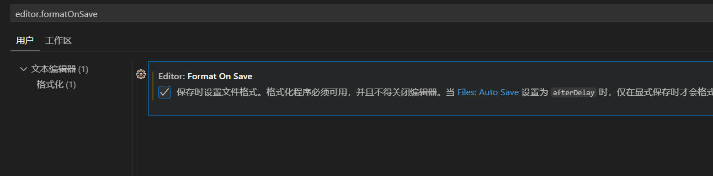

# 基础配置

## 1、终端命令权限获取
windows打开powerShell
```bash
set-ExecutionPolicy RemoteSigned
```
<!-- 显示./assert/1.jpg图片 -->


## 2、python代码格式化插件：autopep8

## 3、隐藏文件夹
打开设置，搜索`files.exclude`，添加需要隐藏的文件夹名称即可


## 4、自动格式化代码
打开设置，搜索`editor.formatOnSave`，勾选即可

